<p align="center">
<h1 align="center"> MyArxiv</h1>
</p>


<p align="center">
  	<a href="https://img.shields.io/badge/version-v0.1.0-blue">
      
    </a>
  <a>
       
  	</a>
  <a>
       
  	</a>
   	<a href="https://github.com/MLNLP-World/MyArxiv/stargazers">
       
  	</a>
  	<a href="https://github.com/MLNLP-World/MyArxiv/network/members">
       
  	</a>
    <a href="https://github.com/MLNLP-World/MyArxiv/issues">
      
    </a>
    <br />
</p>
<div align="center">
<p align="center">
  <a href="#项目动机">Motivation</a>/
  <a href="#项目简介">Introduction</a>/
  <a href="#项目预览">Preview</a>/
  <a href="#使用说明">Usage</a>/
  <a href="#快速上手指南">Quick Start Guide</a>/
  <a href="#定制化指南">Customization Guide</a>/
  <a href="#参考资源">References</a>/
  <a href="#致谢">Acknowledgements</a>/
  <a href="#组织者">Organizers</a>/
  <a href="#贡献者">Contributors</a>
</p>
</div>


---


##  Motivation

As one of the most popular preprint websites for academic papers, `Arxiv` publishes a huge amount of the latest research every day. In this era of information explosion, many frontline researchers spend a significant amount of time searching and reviewing papers to filter out "irrelevant" ones to effectively keep up with "relevant" research. This undoubtedly places a heavy burden on scientific research. To help everyone read the latest Arxiv papers efficiently and freely, this project provides a personalized and customizable template for `Arxiv`, enabling effective tracking of content, authors, and academic conferences in specific fields, transforming `Arxiv` into `MyArxiv`.


The badges used in this project are from the internet. If you believe your image copyright has been infringed, please contact us for removal. Thank you.

##  Introduction

The `MyArxiv` project is based on the [`Arxiv Official API`](https://arxiv.org/help/api) and [`Github Actions`](https://docs.github.com/en/actions) services. It provides a customized Arxiv service. By configuring relevant files, users can personally and easily browse their own Arxiv site from the latest research results published daily on `Arxiv`. Its functions are as follows:

**Basic Functions**:

- Track the latest achievements in specified fields
- Cache article information for specified time periods

**Featured Functions**:

- Quickly focus on specified **keywords** in article titles
- Easily notice specified **scholars** among article authors
- Stay updated on academic articles from well-known **conferences and journals**

##  Preview

Users can visit [https://mlnlp-world.github.io/MyArxiv/](https://mlnlp-world.github.io/MyArxiv/) to preview the current project to better familiarize themselves with its use.

- `MyArxiv` general page overview:

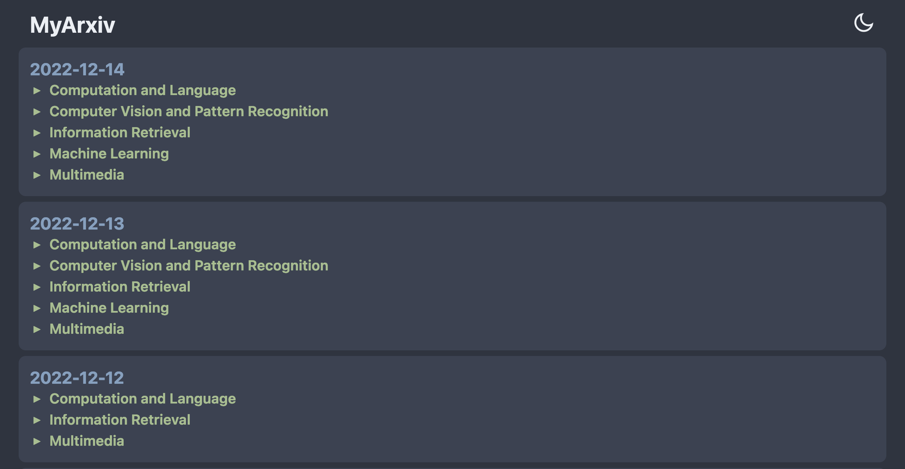

It contains the latest update status of articles in specified fields over multiple days.

- Further view the list of updated articles in a field:

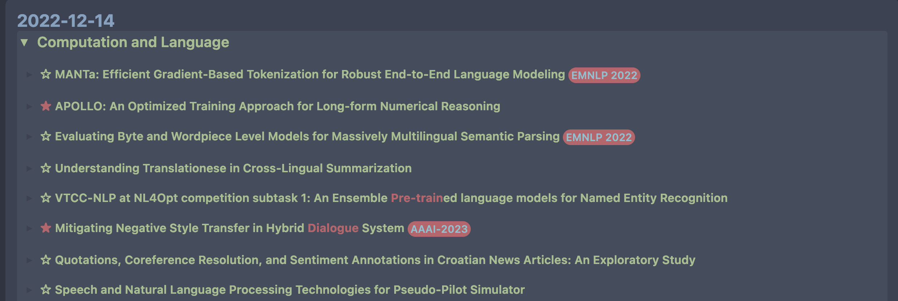

Each entry has a prefix identifier of a specific type (e.g., `☆` or `★` indicates whether there is a highlighted author), highlighted article titles (e.g., `Dialogue`), and corresponding conference information (e.g., `EMNLP 2022`).

- View interested article content in more detail:

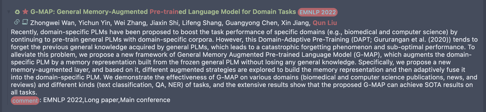

This includes a highlighted detailed author list (e.g., `Qun Liu`), an abstract, and the corresponding `comment` (e.g., `EMNLP 2022, Long paper, Main conference`).

##  Usage

- Click the `Title` to expand and carefully read the abstract.
- Click the `Abstract` to jump to the corresponding `Arxiv` article.
- Highlighted display of specified keywords, specified scholars, and conference/journal information.
- Distinguish whether a paper is newly submitted or updated `♻` via the article entry prefix identifier.
- Distinguish whether a paper was written by a highlighted author `☆` or `★` via the article entry prefix identifier.
- Use the `Tab` key to expand/collapse all articles.
- Implementation of Latex formula rendering.
- Support for Dark/Light mode.

##  Quick Start Guide

To implement a personally customized Arxiv using MyArxiv with default settings, follow these steps:

<details open="open">
  <summary>Get Start</summary>
  <ul>
       <li><a href="#create-repo"> ➤ 1. Create Repository</a></li>
       <li><a href="#modify-cachr-url"> ➤ 2. Modify cache url</a></li>
       <li><a href="#github-pages-start"> ➤ 3. Github Pages Settings</a></li>
  </ul>
</details>

<h4 id="create-repo">1. Create Repository</h4>

The current MyArxiv repository is a template repository. When creating your own MyArxiv, you need to create a new repository from this template under your own Github account.

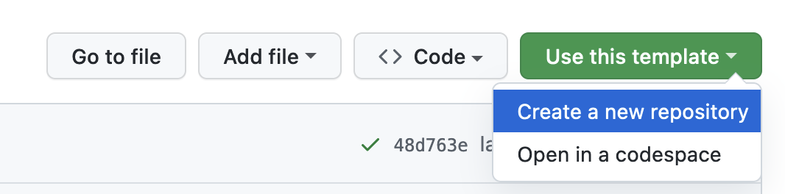

Assume the repository address is `github.com/username/reponame` for subsequent explanation.

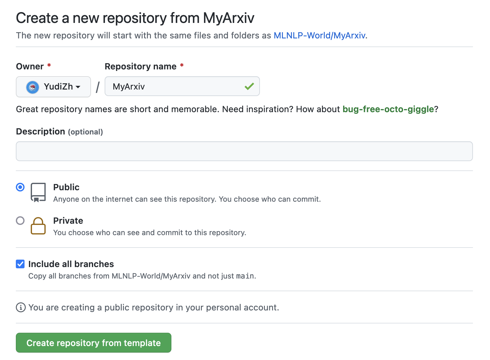

<h4 id="modify-cachr-url">2. Modify cache url</h4>

Modify the `cache_url` setting in the `config.toml` file (the data cache address for MyArxiv; this address is related to the website address where you host the current project). Change the Github account from `MLNLP-World` to your own account, as shown below:

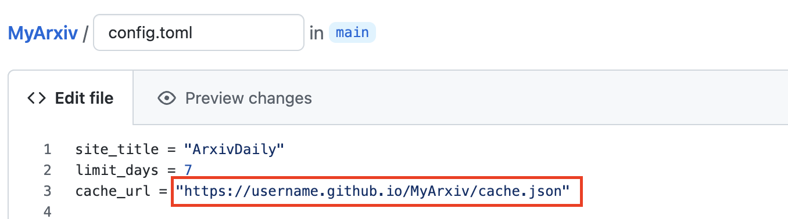

<h4 id="github-pages-start">3. Github Pages Settings</h4>

Go to the Settings of the current Repo, enter the Pages page, and set the `Branch` to the `gh-pages` branch.

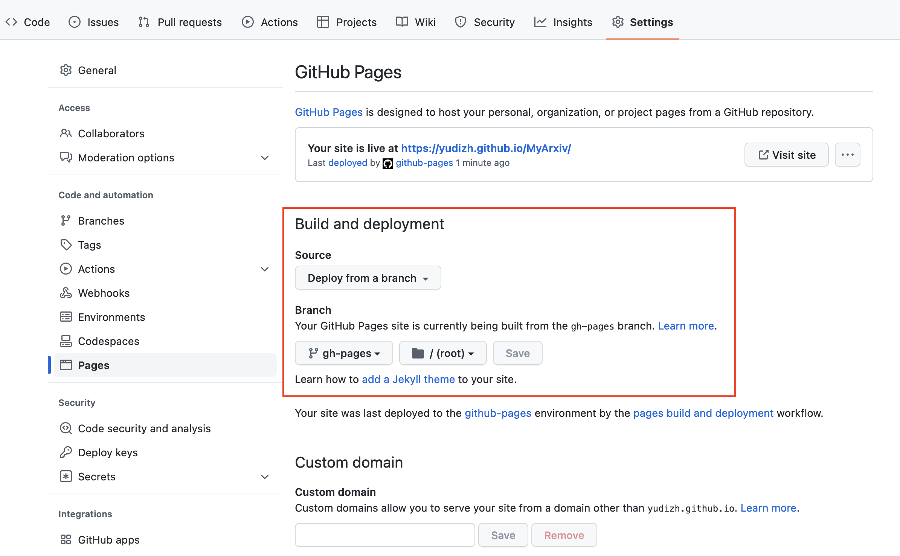

At this point, you have completed the quick start based on the default configuration of `MyArxiv`. By visiting the corresponding Github Pages webpage `username.github.io/MyArxiv`, you can view your own `MyArxiv`:

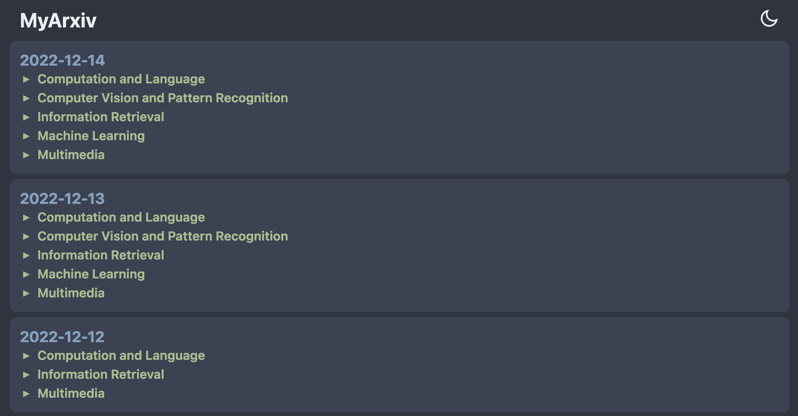

##  Customization Guide

MyArxiv is highly customizable. Users can make changes according to their actual needs to achieve personalized customization. The following describes the customizable parts.

<details open="open">
  <summary>Build Steps</summary>
  <ul>
        <li><a href="#website-settings"> ➤ 1. Hosting Website Settings</a></li>
        <li><a href="#Arxiv-domain"> ➤ 2. Arxiv Domain Preference Settings </a></li>
        <li><a href="#highlight-scripts"> ➤ 3. Highlight Script Settings </a></li>
        <li><a href="#workflow-settings"> ➤ 4. Workflow Settings </a></li>
        <li><a href="#MyArxiv-website-settings"> ➤ 5. MyArxiv Webpage Settings </a></li>
        <li><a href="#Github-Pages-settings"> ➤ 6. Github Pages Settings </a></li>
  </ul>
</details>

<h4 id="website-settings">1. Hosting Website Settings</h4>

The personal website related settings in the `config.toml` configuration file are shown below:

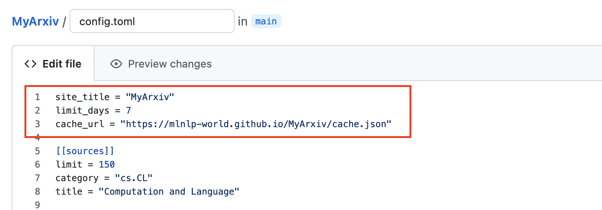

This part is related to the website settings where the personal MyArxiv is hosted. Default settings are as follows:

```toml
site_title = "MyArxiv"
limit_days = 7
cache_url = "https://mlnlp-world.github.io/MyArxiv/cache.json"
```

- `site_title`: Name of the MyArxiv site, defaults to `"MyArxiv"`.

- `limit_days`: Number of past days for which the latest papers are cached on the MyArxiv site, defaults to `7` days.

- `cache_url`: Data cache address for MyArxiv, which is related to the website address where you host the project.
  - If using the default Github Pages, the project will be hosted on the `username.github.io` domain, and the specific project address will be `username.github.io/reponame`. You should set `cache_url` to `username.github.io/reponame/cache.json`.
  - If using another domain `yourarxivdomain` to host the project, replace the `cache_url` with the corresponding URL: `yourarxivwebsite/cache.json`.

<h4 id="Arxiv-domain">2. Arxiv Domain Preference Settings</h4>

The Arxiv domain preference settings in the `config.toml` configuration file are shown below:

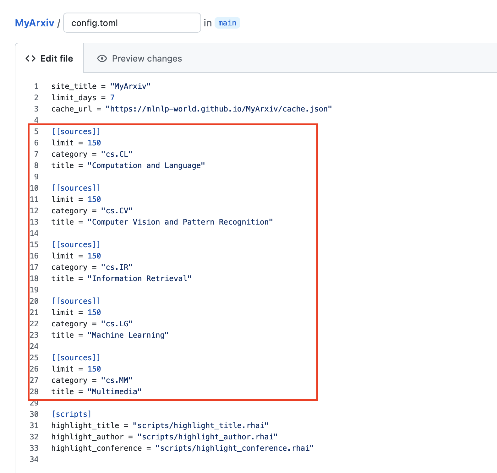

This part is related to the personalized Arxiv domain configuration. An example setting is as follows:

```toml
[[sources]]
limit = 150
category = "cs.CL"
title = "Computation and Language"
```

- `limit`: The number of papers to update daily in the current Arxiv domain, defaults to `150`. (*Generally, the daily update number of Arxiv papers in most single domains does not exceed 150.*)
- `category`: The domain identifier for the Arxiv articles of interest. Refer to the [Arxiv](https://arxiv.org/) official website to find the corresponding identifier.
- `title`: The domain name corresponding to the domain identifier. Refer to the [Arxiv](https://arxiv.org/) official website to find the corresponding name.

The above setting is an example of a configuration unit for one Arxiv domain. The default settings cover the `cs.CL`, `cs.CV`, `cs.IR`, `cs.LG`, and `cs.MM` domains primarily focused on by NLP researchers. Users can change these according to their research preferences.

<h4 id="highlight-scripts">3. Highlight Script Settings</h4>

The highlight script settings in the `config.toml` configuration file are shown below:

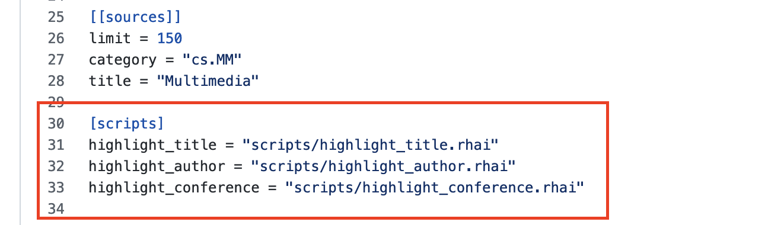

This part is related to personalized highlight information. Users can further add customized highlight information based on their research preferences.

```toml
[scripts]
highlight_title = "scripts/highlight_title.rhai"
highlight_author = "scripts/highlight_author.rhai"
highlight_conference = "scripts/highlight_conference.rhai"
```

Currently supported highlight information includes article titles, authors, and conference names. However, the information provided here is only the location of the script files. Users need to go to the script folder `./scripts` to modify the corresponding highlight configuration file `./scripts/config.rhai`. The relevant settings in the file are as follows:

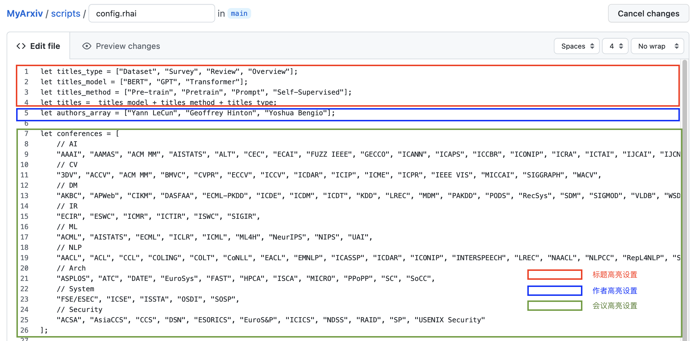

In `./scripts/config.rhai`, customization is as follows:

- `let titles = titles_model + titles_method + titles_type;`: Title highlighting can be customized. By default, it consists of three parts: ***Model***, ***Method***, and ***Type***:
  - `let titles_type = ["Dataset", "Survey"];`: Add article types to be highlighted;
  - `let titles_model = ["BERT", "GPT", "Transformer"];`: Add article model information to be highlighted;
  - `let titles_method = ["Pre-train", "Pretrain", "Prompt", "Self-Supervised"];`: Add article method information to be highlighted;
- `let authors_array = ["Yann LeCun", "Geoffrey Hinton", "Yoshua Bengio"];`: Add author information to be highlighted;
- `let conferences = [];`: List of highlighted conferences, which by default includes most mainstream conference information in the current AI field;

<h4 id="workflow-settings">4. Workflow Settings</h4>

The workflow settings are located in the file `./.github/workflows/update-feed.yml`:

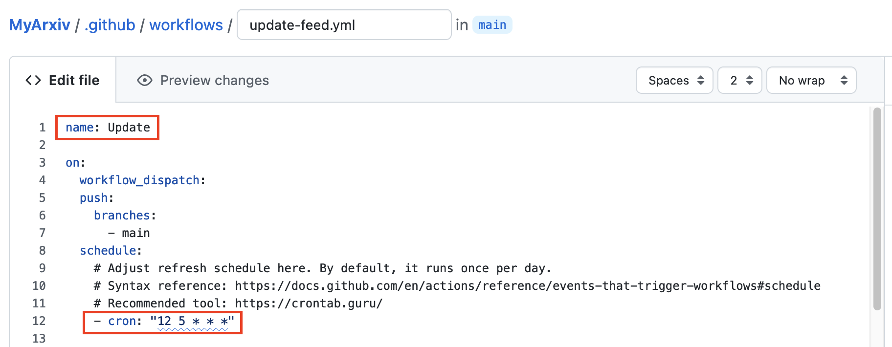

You can refer to the following parts that need modification in this file.

- `name: workflowname`: Name the Workflow, defaults to `Update`.

- `- cron: "12 5 * * *"`: Set the time for the Workflow to run, which is the daily update time for MyArxiv. *You can refer to [crontab](https://crontab.guru/) to adjust the time.*

<h4 id="MyArxiv-website-settings">5. MyArxiv Webpage Settings</h4>

After completing the personalized customization of MyArxiv, the webpage display is modified. The main target file for modification is `./includes/index.hbs`. Users can make various changes to the webpage format according to their style preference. Two examples of changes are provided below:

- Modification of the webpage title:

  In `index.hbs`, the webpage title configuration is as follows:

  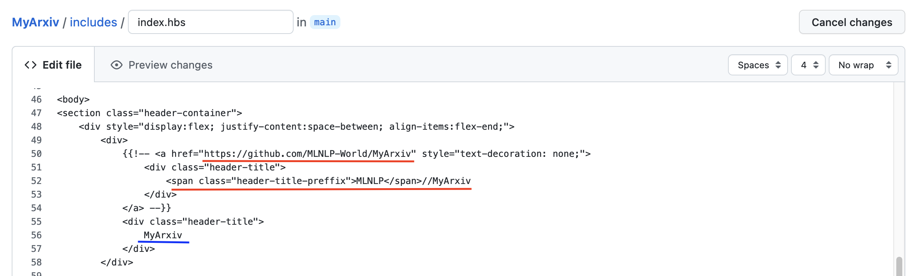

  - The blue highlighted part on `line 56` is the currently configured webpage title, which users can change themselves:

    ```js
    <div class="header-title">
                    NAME YOU LIKE
                </div>
    ```

  - In the section on `line 50` of `index.hbs`, the commented-out part highlighted in red represents the setting for linking your own `MyArxiv` repository address and renaming the title. This setting can be used to replace the default webpage title. The modification format is as follows:

    ```js
        <div style="display:flex; justify-content:space-between; align-items:flex-end;">
            <div>
                <a href="https://github.com/username/reponame" style="text-decoration: none;">
                    <div class="header-title">
                        <span class="header-title-preffix">NAME YOU LIKE
                    </div>
                </a>
            </div>
    ```

- Modification of badges:

  In `index.hbs`, the webpage title configuration is as follows:

  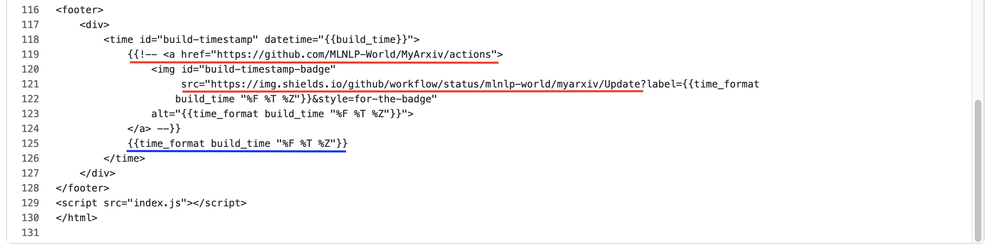
  
  - The blue highlighted part on `line 125` is the currently configured webpage timestamp, which users can change as needed:
  
    ```js
    {{time_format build_time "%F %T %Z"}}
    ```
  
  - In the section on `line 119` of `index.hbs`, the commented-out part highlighted in red indicates the use of shield.io to update the current workflow's build timestamp in real-time. Modify the workflow address linked on `line 118` of `index.hbs`. This setting can be used to set a badge to replace the default webpage timestamp. The modification format is as follows:
  
    ```js
    
    ```

    The `workflowname` involved must be consistent with the `name` in `./.github/workflows/update-feed.yml`.

After completing the configuration modifications, commit the changes to your personal Github repository.

<h4 id="Github-Pages-settings">6. Github Pages Settings</h4>

After completing the above customization, you need to configure the Github Pages for your personal MyArxiv library to host the project:

- Visit the `Github Pages` settings: `https://github.com/username/reponame/settings/pages`

  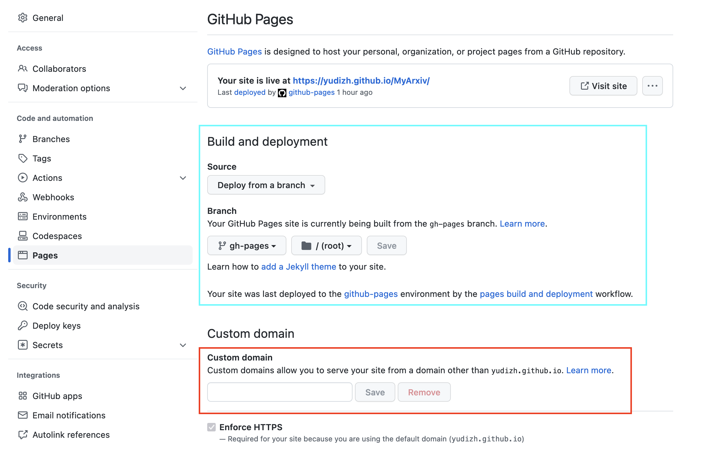

- If using `username.github.io` to host MyArxiv:
  - Set the `Branch` to the `gh-pages` branch;
  - Once the Build is successful, customization is complete;
  - Visit `username.github.io/reponame` to access your customized MyArxiv.
  
- If using another domain to host MyArxiv:
  - Set the `Branch` to the `gh-pages` branch;
  - Enter your domain in `Custom Domain`;
  - Create a `CNAME` file in the `./statics` folder and write the domain into it:
  
    ```shell
    >> cd ./statics
    >> touch CNAME
    >> echo "your domain" > CNAME
    ```
  - Once the Build is successful, customization is complete;
  - Visit `username.github.io/reponame` to access your customized MyArxiv.

And that's it! You have completed the customization of `MyArxiv`. **Enjoy *YourArxiv* !**

##  References

This project refers in part to the following projects:
- [ArxivFeed Template](https://github.com/NotCraft/ArxivDaily)
- Powered By [ArxivFeed](https://github.com/NotCraft/ArxivFeed)

##  Acknowledgements

Thanks to the following projects for their help with this project:
- [Osmosfeed](https://github.com/osmoscraft/osmosfeed)
- [AlongWY Version](https://github.com/AlongWY/ArxivDaily)
- [LooperXX Osmosfeed Version](https://github.com/LooperXX/ArxivDaily-Old)

##  Organizers

Thanks to the following students for organizing this project:

<a href="https://github.com/AlongWY">  </a>
<a href="https://github.com/LooperXX">  </a>
<a href="https://github.com/YudiZh">  </a>
<a href="https://github.com/yizhen20133868">  </a>


##  Contributors

Thanks to the following students for their support and contributions to this project:

<a href="https://github.com/AlongWY">  </a>
<a href="https://github.com/LooperXX">  </a>
<a href="https://github.com/YudiZh">  </a>
<a href="https://github.com/entslscheia">  </a>
